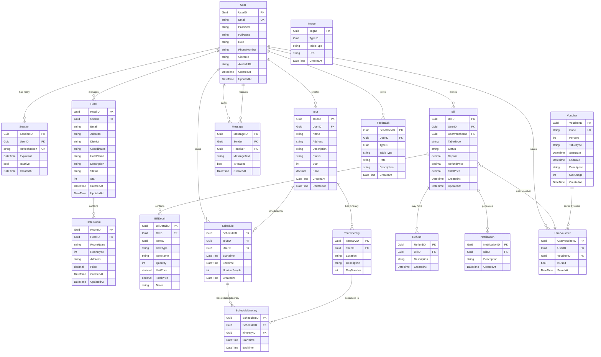

# BE_OPENSKY - Tài liệu API

Hệ thống quản lý du lịch tích hợp với 16 bảng database và API đầy đủ.

## Database Schema

Ghi chú: PK = Primary Key, FK = Foreign Key, UK = Unique Key

## Authentication (/api/auth)

- POST /register: Đăng ký tài khoản mới
- POST /login: Đăng nhập, trả về JWT token
- POST /change-password: Đổi mật khẩu (yêu cầu đăng nhập)
- POST /refresh-token: Làm mới access token
- POST /logout: Đăng xuất, vô hiệu hóa session

## Users (/api/users)

- GET /: Lấy danh sách người dùng (Management)
- GET /{id}: Lấy người dùng theo ID (Management)
- PUT /{id}: Cập nhật thông tin người dùng (chủ sở hữu/Management)
- DELETE /{id}: Xóa người dùng (Admin)
- GET /profile: Lấy thông tin profile hiện tại (đăng nhập)
- PUT /profile: Cập nhật profile (đăng nhập)

## Tours (/api/tours)

- GET /: Lấy tất cả tour (có filter, paging)
- GET /{id}: Lấy tour theo ID
- GET /user/{userId}: Lấy các tour của một user
- POST /: Tạo tour mới (yêu cầu đăng nhập)
- PUT /{id}: Cập nhật tour (chủ sở hữu/Management)
- DELETE /{id}: Xóa tour (chủ sở hữu/Admin)
- GET /{id}/itinerary: Lấy lịch trình tour
- POST /{id}/itinerary: Thêm lịch trình tour (chủ sở hữu/Management)
- PUT /itinerary/{itineraryId}: Cập nhật lịch trình tour (chủ sở hữu/Management)
- DELETE /itinerary/{itineraryId}: Xóa lịch trình tour (chủ sở hữu/Management)

## Hotels (/api/hotels)

- GET /: Lấy tất cả khách sạn (có filter, paging)
- GET /{id}: Lấy khách sạn theo ID
- GET /user/{userId}: Lấy các khách sạn của một user
- POST /: Tạo khách sạn mới (yêu cầu đăng nhập)
- PUT /{id}: Cập nhật khách sạn (chủ sở hữu/Management)
- DELETE /{id}: Xóa khách sạn (chủ sở hữu/Admin)
- GET /{id}/rooms: Lấy danh sách phòng của khách sạn
- POST /{id}/rooms: Thêm phòng mới (chủ sở hữu/Management)
- PUT /rooms/{roomId}: Cập nhật phòng (chủ sở hữu/Management)
- DELETE /rooms/{roomId}: Xóa phòng (chủ sở hữu/Management)

## Schedules (/api/schedules)

- GET /: Lấy lịch trình của user hiện tại (đăng nhập)
- GET /{id}: Lấy chi tiết lịch trình (chủ sở hữu/Management)
- POST /: Đặt tour mới (đăng nhập)
- PUT /{id}: Cập nhật lịch trình (chủ sở hữu/Management)
- DELETE /{id}: Hủy lịch trình (chủ sở hữu/Management)
- GET /{id}/itinerary: Lấy chi tiết lịch trình (chủ sở hữu/Management)

## Bills (/api/bills)

- GET /: Lấy danh sách hóa đơn của user (đăng nhập)
- GET /{id}: Lấy chi tiết hóa đơn (chủ sở hữu/Management)
- POST /: Tạo hóa đơn mới (đăng nhập)
- PUT /{id}/status: Cập nhật trạng thái hóa đơn (Management)
- POST /{id}/payment: Thanh toán hóa đơn (chủ sở hữu)
- GET /{id}/details: Lấy chi tiết hóa đơn (chủ sở hữu/Management)

## Vouchers (/api/vouchers)

- GET /admin/all: Lấy tất cả voucher (Admin)
- GET /admin/{id}: Lấy voucher theo ID (Admin)
- GET /admin/type/{tableType}: Lấy voucher theo loại Tour/Hotel (Admin)
- GET /admin/active: Lấy voucher đang hiệu lực (Admin)
- GET /admin/expired: Lấy voucher hết hạn (Admin)
- GET /admin/statistics: Thống kê voucher (Admin)
- POST /admin: Tạo voucher mới (Admin)
- PUT /admin/{id}: Cập nhật voucher (Admin)
- DELETE /admin/{id}: Xóa voucher (Admin)
- GET /available: Danh sách voucher có thể lưu (public)
- GET /search/{code}: Tìm voucher theo mã (public)
- POST /save: Lưu voucher vào tài khoản (đăng nhập)
- GET /my-vouchers: Xem voucher đã lưu (đăng nhập)
- DELETE /my-vouchers/{userVoucherId}: Bỏ lưu voucher (đăng nhập)
- GET /user/{userId}: Xem voucher của một user (user đó/Admin)

## Messages (/api/messages)

- GET /: Lấy tin nhắn của user hiện tại (đăng nhập)
- GET /conversation/{userId}: Lấy cuộc trò chuyện với user khác (đăng nhập)
- POST /: Gửi tin nhắn mới (đăng nhập)
- PUT /{id}/read: Đánh dấu tin nhắn đã đọc (người nhận)
- DELETE /{id}: Xóa tin nhắn (người gửi/Admin)

## Feedback (/api/feedback)

- GET /{tableType}/{typeId}: Lấy feedback theo đối tượng (Tour/Hotel)
- POST /: Tạo feedback mới (đăng nhập)
- PUT /{id}: Cập nhật feedback (chủ sở hữu)
- DELETE /{id}: Xóa feedback (chủ sở hữu/Admin)
- GET /user/{userId}: Lấy feedback của một user (Management)

## Refunds (/api/refunds)

- GET /: Lấy danh sách yêu cầu hoàn tiền (Management)
- GET /{id}: Lấy chi tiết yêu cầu hoàn tiền (chủ sở hữu/Management)
- POST /: Tạo yêu cầu hoàn tiền (chủ sở hữu hóa đơn)
- PUT /{id}/status: Xử lý yêu cầu hoàn tiền (Management)
- GET /bill/{billId}: Lấy yêu cầu hoàn tiền theo hóa đơn

## Notifications (/api/notifications)

- GET /: Lấy thông báo của user hiện tại (đăng nhập)
- GET /{id}: Lấy chi tiết thông báo (người nhận/Management)
- PUT /{id}/read: Đánh dấu thông báo đã đọc (người nhận)
- DELETE /{id}: Xóa thông báo (người nhận/Admin)

## Images (/api/images)

- POST /upload: Upload ảnh (multipart/form-data) gồm: tableType, typeId, file, description (đăng nhập)
- GET /{tableType}/{typeId}: Lấy danh sách ảnh theo đối tượng
- GET /{id}: Lấy ảnh theo ID
- PUT /{id}: Cập nhật mô tả ảnh (chủ sở hữu/Management)
- DELETE /{id}: Xóa ảnh (chủ sở hữu/Management)
- DELETE /{tableType}/{typeId}/all: Xóa tất cả ảnh của đối tượng (Management)
- GET /avatar/{userId}: Lấy avatar của user
- POST /avatar/{userId}/{imageId}: Đặt ảnh làm avatar user (user đó/Admin)

## Data Types & Status

**TableType hợp lệ:**

- "Tour": Tour du lịch
- "Hotel": Khách sạn
- "HotelRoom": Phòng khách sạn
- "User": Người dùng

**User Roles:**

- "Customer": Khách hàng
- "TourGuide": Hướng dẫn viên
- "HotelManager": Quản lý khách sạn
- "Admin": Quản trị viên

**Status Types:**

- Tour/Hotel Status: "Active", "Inactive", "Pending"
- Bill Status: "Pending", "Paid", "Cancelled", "Refunded"

**Technical Stack:**

- .NET 8 + Entity Framework Core
- JWT Authentication + Redis Session
- SendGrid Email + Cloudinary Images
- SQL Server Database
