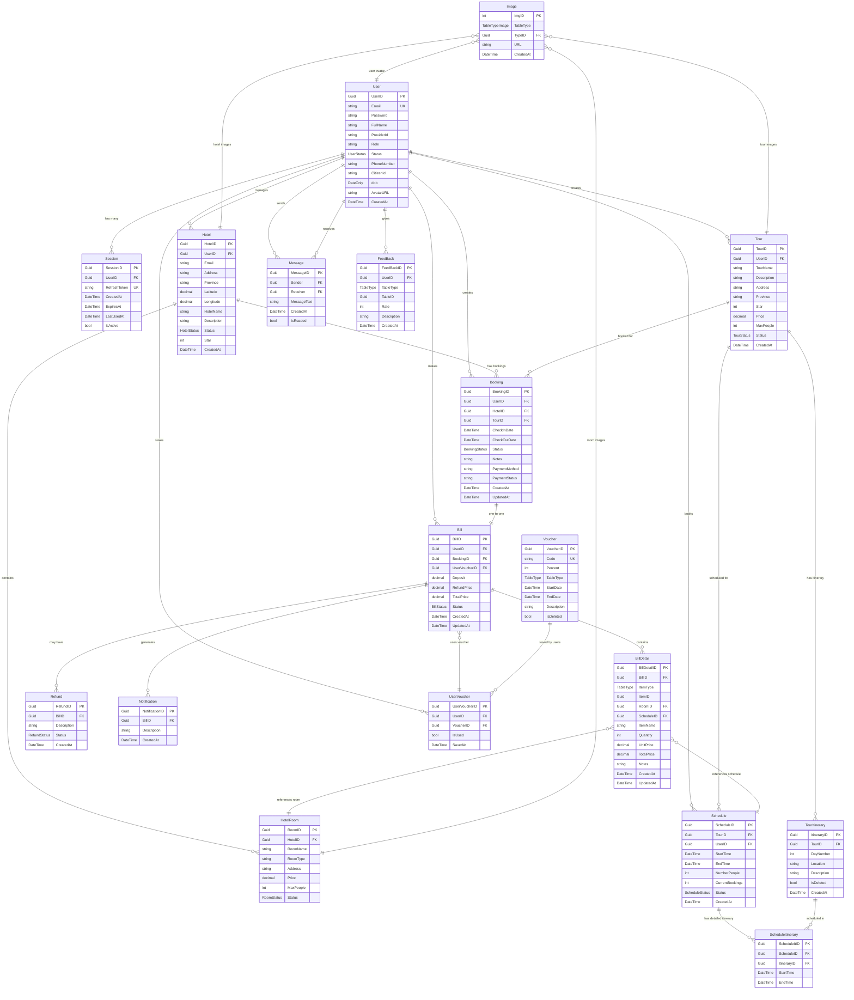

# BE_OPENSKY - Tài liệu API.

Hệ thống quản lý du lịch tích hợp với 16 bảng database và API đầy đủ.

## Database Schema

```mermaid
erDiagram
    User {
        Guid UserID PK
        string Email UK
        string Password
        string FullName
        string ProviderId
        string Role
        UserStatus Status
        string PhoneNumber
        string CitizenId
        DateOnly dob
        string AvatarURL
        DateTime CreatedAt
    }

    Session {
        Guid SessionID PK
        Guid UserID FK
        string RefreshToken UK
        DateTime CreatedAt
        DateTime ExpiresAt
        DateTime LastUsedAt
        bool IsActive
    }

    Tour {
        Guid TourID PK
        Guid UserID FK
        string TourName
        string Description
        string Address
        string Province
        int Star
        decimal Price
        int MaxPeople
        TourStatus Status
        DateTime CreatedAt
    }

    Hotel {
        Guid HotelID PK
        Guid UserID FK
        string Email
        string Address
        string Province
        decimal Latitude
        decimal Longitude
        string HotelName
        string Description
        HotelStatus Status
        int Star
        DateTime CreatedAt
    }

    HotelRoom {
        Guid RoomID PK
        Guid HotelID FK
        string RoomName
        string RoomType
        string Address
        decimal Price
        int MaxPeople
        RoomStatus Status
    }

    Message {
        Guid MessageID PK
        Guid Sender FK
        Guid Receiver FK
        string MessageText
        DateTime CreatedAt
        bool IsReaded
    }

    Booking {
        Guid BookingID PK
        Guid UserID FK
        Guid HotelID FK
        Guid TourID FK
        DateTime CheckInDate
        DateTime CheckOutDate
        BookingStatus Status
        string Notes
        string PaymentMethod
        string PaymentStatus
        DateTime CreatedAt
        DateTime UpdatedAt
    }

    Bill {
        Guid BillID PK
        Guid UserID FK
        Guid BookingID FK
        Guid UserVoucherID FK
        decimal Deposit
        decimal RefundPrice
        decimal TotalPrice
        BillStatus Status
        DateTime CreatedAt
        DateTime UpdatedAt
    }

    BillDetail {
        Guid BillDetailID PK
        Guid BillID FK
        TableType ItemType
        Guid ItemID
        Guid RoomID FK
        Guid ScheduleID FK
        string ItemName
        int Quantity
        decimal UnitPrice
        decimal TotalPrice
        string Notes
        DateTime CreatedAt
        DateTime UpdatedAt
    }

    Schedule {
        Guid ScheduleID PK
        Guid TourID FK
        Guid UserID FK
        DateTime StartTime
        DateTime EndTime
        int NumberPeople
        int CurrentBookings
        ScheduleStatus Status
        DateTime CreatedAt
    }

    TourItinerary {
        Guid ItineraryID PK
        Guid TourID FK
        int DayNumber
        string Location
        string Description
        bool IsDeleted
        DateTime CreatedAt
    }

    ScheduleItinerary {
        Guid ScheduleItID PK
        Guid ScheduleID FK
        Guid ItineraryID FK
        DateTime StartTime
        DateTime EndTime
    }

    FeedBack {
        Guid FeedBackID PK
        Guid UserID FK
        TableType TableType
        Guid TableID
        int Rate
        string Description
        DateTime CreatedAt
    }

    Refund {
        Guid RefundID PK
        Guid BillID FK
        string Description
        RefundStatus Status
        DateTime CreatedAt
    }

    Notification {
        Guid NotificationID PK
        Guid BillID FK
        string Description
        DateTime CreatedAt
    }

    Image {
        int ImgID PK
        TableTypeImage TableType
        Guid TypeID FK
        string URL
        DateTime CreatedAt
    }

    Voucher {
        Guid VoucherID PK
        string Code UK
        int Percent
        TableType TableType
        DateTime StartDate
        DateTime EndDate
        string Description
        bool IsDeleted
    }

    UserVoucher {
        Guid UserVoucherID PK
        Guid UserID FK
        Guid VoucherID FK
        bool IsUsed
        DateTime SavedAt
    }

    User ||--o{ Session : "has many"
    User ||--o{ Tour : "creates"
    User ||--o{ Hotel : "manages"
    User ||--o{ Message : "sends"
    User ||--o{ Message : "receives"
    User ||--o{ Bill : "makes"
    User ||--o{ Booking : "creates"
    User ||--o{ Schedule : "books"
    User ||--o{ FeedBack : "gives"
    User ||--o{ UserVoucher : "saves"

    Hotel ||--o{ HotelRoom : "contains"
    Hotel ||--o{ Booking : "has bookings"

    Booking ||--|| Bill : "one-to-one"

    Tour ||--o{ Schedule : "scheduled for"
    Tour ||--o{ TourItinerary : "has itinerary"
    Tour ||--o{ Booking : "booked for"

    Bill ||--o{ BillDetail : "contains"
    Bill ||--o{ Refund : "may have"
    Bill ||--o{ Notification : "generates"
    Bill }o--|| UserVoucher : "uses voucher"

    Schedule ||--o{ ScheduleItinerary : "has detailed itinerary"

    TourItinerary ||--o{ ScheduleItinerary : "scheduled in"

    Voucher ||--o{ UserVoucher : "saved by users"

    BillDetail }o--|| HotelRoom : "references room"
    BillDetail }o--|| Schedule : "references schedule"
    Image }o--|| User : "user avatar"
    Image }o--|| Hotel : "hotel images"
    Image }o--|| HotelRoom : "room images"
    Image }o--|| Tour : "tour images"
```

Ghi chú: PK = Primary Key, FK = Foreign Key, UK = Unique Key
